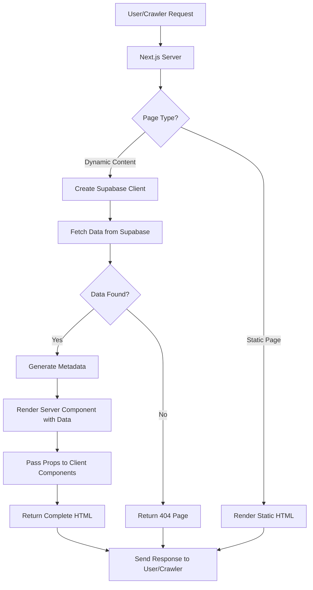

# SSR vs SSG Analysis & SEO Compatibility Report

## Executive Summary

This project implements **Server-Side Rendering (SSR)** with no caching (`revalidate = 0`), not Static Site Generation (SSG). All dynamic content from Supabase is rendered on the server for each request, ensuring web crawlers can access and index the content for SEO purposes.

---

## 1. Rendering Strategy Analysis

### 1.1 Framework Configuration

**File:** [`next.config.mjs`](../next.config.mjs:1)

- **Next.js Version:** 16.0.10 (App Router)
- **React Version:** 19.2.0
- **No specific SSR/SSG configuration** - defaults to Server Components

### 1.2 Rendering Mode: Server-Side Rendering (SSR)

The project uses **SSR** exclusively, evidenced by:

| Page | `revalidate` Value | Rendering Mode |
|------|-------------------|----------------|
| [`app/page.tsx`](../app/page.tsx:6) | `0` | SSR (no cache) |
| [`app/blog/page.tsx`](../app/blog/page.tsx:28) | `0` | SSR (no cache) |
| [`app/blog/[slug]/page.tsx`](../app/blog/[slug]/page.tsx:11) | `0` | SSR (no cache) |
| [`app/packages/page.tsx`](../app/packages/page.tsx:28) | `0` | SSR (no cache) |
| [`app/packages/[slug]/page.tsx`](../app/packages/[slug]/page.tsx:1) | No explicit value | SSR (no cache) |
| [`app/diaries/page.tsx`](../app/diaries/page.tsx:27) | `0` | SSR (no cache) |
| [`app/diaries/[slug]/page.tsx`](../app/diaries/[slug]/page.tsx:11) | `0` | SSR (no cache) |

**Key Finding:** `export const revalidate = 0` means "always fetch fresh data" - this is pure SSR with no ISR (Incremental Static Regeneration).

### 1.3 No SSG Implementation

**Evidence:**
- No `generateStaticParams()` functions found in any dynamic route files
- All pages use `async` functions with Supabase queries on each request
- No static HTML generation at build time

---

## 2. Data Fetching Implementation

### 2.1 Supabase Client Configuration

**Public Client** ([`lib/supabase/public.ts`](../lib/supabase/public.ts:1)):
```typescript
export function createPublicClient() {
  const proxyUrl = process.env.NEXT_PUBLIC_SUPABASE_PROXY_URL || process.env.NEXT_PUBLIC_SUPABASE_URL!
  return createSupabaseClient(
    proxyUrl,
    process.env.NEXT_PUBLIC_SUPABASE_ANON_KEY!,
    {
      auth: {
        persistSession: false,
        autoRefreshToken: false,
        detectSessionInUrl: false,
      },
    }
  )
}
```

**Server Client** ([`lib/supabase/server.ts`](../lib/supabase/server.ts:1)):
```typescript
export async function createClient() {
  const cookieStore = await cookies()
  const proxyUrl = process.env.NEXT_PUBLIC_SUPABASE_PROXY_URL || process.env.NEXT_PUBLIC_SUPABASE_URL!
  return createServerClient(proxyUrl, process.env.NEXT_PUBLIC_SUPABASE_ANON_KEY!, {
    cookies: { getAll() { return cookieStore.getAll() }, ... }
  })
}
```

### 2.2 Data Fetching Patterns

All content pages follow the same pattern:

**Blog Listing** ([`app/blog/page.tsx`](../app/blog/page.tsx:30-64)):
```typescript
export default async function BlogPage() {
  const supabase = createPublicClient()
  const { data, error } = await supabase
    .from("blogs")
    .select("*")
    .eq("is_published", true)
    .order("published_at", { ascending: false })
  return <BlogPageClient blogs={blogs} categories={categories} />
}
```

**Blog Detail** ([`app/blog/[slug]/page.tsx`](../app/blog/[slug]/page.tsx:55-68)):
```typescript
export default async function BlogDetailPage({ params }: BlogDetailPageProps) {
  const { slug } = await params
  const supabase = createPublicClient()
  const { data: post, error } = await supabase
    .from("blogs")
    .select("*")
    .eq("slug", slug)
    .eq("is_published", true)
    .single()
  // ... render
}
```

---

## 3. SEO Compatibility Assessment

### 3.1 Web Crawler Access: ✅ FULLY COMPATIBLE

**Why web crawlers CAN access and index dynamic content:**

1. **Server-Side Rendering**: All content is rendered on the server before being sent to the client. Web crawlers (Googlebot, Bingbot, etc.) receive fully rendered HTML.

2. **No Client-Side Data Fetching for Content**: The critical content (blogs, packages, diaries) is fetched in Server Components and passed as props to Client Components.

3. **Complete HTML in Response**: When a crawler requests `/blog/my-article`, it receives:
   - Complete HTML with article content
   - Meta tags (title, description, OG tags)
   - JSON-LD structured data
   - No JavaScript execution required for content visibility

### 3.2 SEO Features Implemented

#### 3.2.1 Dynamic Metadata Generation

All dynamic pages implement `generateMetadata()`:

**Blog Detail** ([`app/blog/[slug]/page.tsx`](../app/blog/[slug]/page.tsx:13-53)):
```typescript
export async function generateMetadata({ params }: BlogDetailPageProps) {
  const { slug } = await params
  const supabase = createPublicClient()
  const { data: post } = await supabase
    .from("blogs")
    .select("*")
    .eq("slug", slug)
    .eq("is_published", true)
    .single()
  return {
    title: `${post.title} | TourToHimachal Blog`,
    description: post.excerpt,
    alternates: { canonical: `${SITE_URL}/blog/${slug}` },
    openGraph: { /* ... */ }
  }
}
```

#### 3.2.2 JSON-LD Structured Data

**Blog Articles** ([`app/blog/[slug]/page.tsx`](../app/blog/[slug]/page.tsx:85-100)):
```typescript
const jsonLd = {
  "@context": "https://schema.org",
  "@type": "Article",
  headline: post.title,
  description: post.excerpt,
  image: post.cover_image || "",
  datePublished: post.published_at,
  author: { "@type": "Person", name: displayAuthor },
  publisher: { "@type": "Organization", name: "TourToHimachal" }
}
```

**Packages** ([`app/packages/[slug]/page.tsx`](../app/packages/[slug]/page.tsx:77-88)):
```typescript
const jsonLd = {
  "@context": "https://schema.org",
  "@type": "TouristTrip",
  name: pkg.title,
  description: pkg.description,
  image: pkg.images,
  offers: {
    "@type": "Offer",
    price: pkg.price,
    priceCurrency: "INR"
  }
}
```

**Diaries** ([`app/diaries/[slug]/page.tsx`](../app/diaries/[slug]/page.tsx:72-87)):
```typescript
const jsonLd = {
  "@context": "https://schema.org",
  "@type": "BlogPosting",
  headline: diary.title,
  description: diary.excerpt,
  image: diary.gallery?.[0] || diary.cover_image,
  datePublished: diary.travel_date || diary.published_at,
  author: { "@type": "Person", name: diary.author_name },
  publisher: { "@type": "Organization", name: "TourToHimachal" }
}
```

#### 3.2.3 Dynamic Sitemap

**File:** [`app/sitemap.ts`](../app/sitemap.ts:1)

The sitemap is dynamically generated from Supabase data:
- Fetches all published blogs, diaries, and active packages
- Includes them in the sitemap with proper priorities and change frequencies
- Revalidates every 3600 seconds (1 hour)

```typescript
export const revalidate = 3600

export default async function sitemap(): Promise<MetadataRoute.Sitemap> {
  // ... fetches blogs, diaries, packages from Supabase
  // ... returns combined sitemap entries
}
```

#### 3.2.4 Robots.txt

**File:** [`app/robots.ts`](../app/robots.ts:1)

```typescript
export default function robots(): MetadataRoute.Robots {
  return {
    rules: [{ userAgent: "*", allow: "/" }],
    sitemap: `${siteUrl}/sitemap.xml`,
    host: siteUrl
  }
}
```

---

## 4. Rendering Flow Diagram



---

## 5. Summary of Key Files

| File | Purpose | Rendering Mode |
|------|---------|----------------|
| [`app/blog/page.tsx`](../app/blog/page.tsx:1) | Blog listing page | SSR (revalidate=0) |
| [`app/blog/[slug]/page.tsx`](../app/blog/[slug]/page.tsx:1) | Individual blog post | SSR (revalidate=0) |
| [`app/packages/page.tsx`](../app/packages/page.tsx:1) | Packages listing | SSR (revalidate=0) |
| [`app/packages/[slug]/page.tsx`](../app/packages/[slug]/page.tsx:1) | Package detail | SSR (no cache) |
| [`app/diaries/page.tsx`](../app/diaries/page.tsx:1) | Diaries listing | SSR (revalidate=0) |
| [`app/diaries/[slug]/page.tsx`](../app/diaries/[slug]/page.tsx:1) | Diary detail | SSR (revalidate=0) |
| [`lib/supabase/public.ts`](../lib/supabase/public.ts:1) | Public Supabase client | N/A |
| [`lib/supabase/server.ts`](../lib/supabase/server.ts:1) | Server Supabase client | N/A |
| [`app/sitemap.ts`](../app/sitemap.ts:1) | Dynamic sitemap | ISR (revalidate=3600) |
| [`app/robots.ts`](../app/robots.ts:1) | Robots.txt | Static |

---

## 6. SEO Compatibility Conclusion

### ✅ Web Crawlers CAN Successfully Access and Index Dynamic Content

**Reasons:**

1. **Server-Side Rendering**: All content is rendered on the server, so crawlers receive complete HTML without JavaScript execution.

2. **No Client-Side Data Fetching for Critical Content**: Blogs, packages, and diaries are fetched in Server Components and passed as props.

3. **Proper Metadata**: Each page has dynamically generated `title`, `description`, `canonical` URLs, and OpenGraph tags.

4. **Structured Data**: JSON-LD schemas are included for Articles, BlogPostings, and TouristTrips.

5. **Dynamic Sitemap**: All dynamic routes are included in the sitemap.xml.

6. **Robots.txt**: Properly configured to allow crawling.

### Potential Considerations

| Issue | Impact | Mitigation |
|-------|--------|------------|
| **No caching (revalidate=0)** | Higher server load, slower response times | Consider ISR with appropriate revalidation times |
| **Database latency** | Slower page load times | Consider adding CDN caching or implementing ISR |
| **Supabase proxy** | Potential single point of failure | The proxy URL has fallback to direct Supabase URL |

---

## 7. Recommendations

### 7.1 Performance Optimization (Optional)

Consider implementing **Incremental Static Regeneration (ISR)** for better performance:

```typescript
// Instead of revalidate = 0, use:
export const revalidate = 3600 // Revalidate every hour
```

This would:
- Cache pages for 1 hour
- Reduce database queries
- Improve response times
- Still allow content updates within reasonable timeframes

### 7.2 Current State is SEO-Friendly

The current implementation is **fully SEO-compatible**. Web crawlers will:
- See complete HTML content
- Access all metadata
- Index structured data
- Follow sitemap links

No changes are required for SEO purposes.
