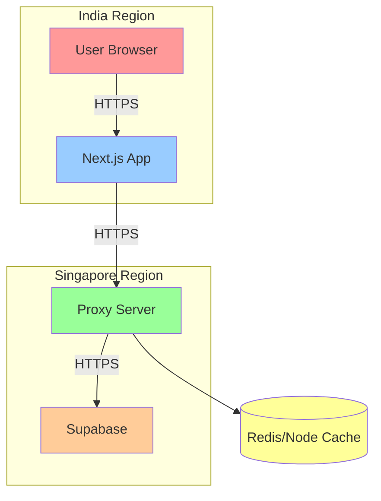

# Supabase Proxy Server Implementation Plan

## Overview
Create a Node.js Express proxy server hosted on Render (Singapore region) to bypass Supabase connectivity issues in India. The proxy will include caching to minimize latency impact.

## Architecture Diagram



## System Components

### 1. Proxy Server (Node.js + Express)
- **Location**: Render (Singapore region)
- **Purpose**: Forward requests to Supabase
- **Features**:
  - Request forwarding for all HTTP methods
  - Header management
  - Error handling
  - Health monitoring
  - Request logging

### 2. Caching Layer (node-cache)
- **Type**: In-memory cache
- **TTL**: 60 seconds (configurable)
- **Scope**: GET requests only
- **Cache Key**: `METHOD:PATH:BODY_HASH`

### 3. Next.js Integration
- **Client-side**: Browser requests via proxy
- **Server-side**: Server requests via proxy
- **Middleware**: Auth requests via proxy

---

## Task Breakdown

### Phase 1: Proxy Server Setup (Tasks 1-8)

#### Task 1: Create proxy server project structure and initialize
**Location**: `e:/Akshat/Client Projects/Tourtohimachal/supabase-proxy-server/`
**Actions**:
- Create new directory
- Initialize npm project
- Install dependencies

**Commands**:
```bash
mkdir supabase-proxy-server
cd supabase-proxy-server
npm init -y
npm install express cors dotenv node-cache
```

**Dependencies**:
- `express` - Web framework
- `cors` - CORS handling
- `dotenv` - Environment variables
- `node-cache` - Caching layer

---

#### Task 2: Implement Express proxy server with core functionality
**File**: `server.js`
**Features**:
- Express app setup
- Middleware configuration
- Request forwarding logic
- Response handling

**Key Functions**:
```javascript
- setupExpressApp()
- configureMiddleware()
- forwardRequest()
- handleResponse()
```

---

#### Task 3: Add caching layer (node-cache) for GET requests
**File**: `server.js` (extend)
**Features**:
- Initialize cache with TTL
- Cache GET requests only
- Cache key generation
- Cache invalidation strategy

**Cache Configuration**:
```javascript
const cache = new NodeCache({
  stdTTL: 60,        // 60 seconds
  checkperiod: 120,     // Check for expired items every 2 min
  useClones: false      // Performance optimization
})
```

**Cache Strategy**:
- **GET requests**: Check cache first, return if exists
- **POST/PUT/DELETE**: Bypass cache, invalidate related entries
- **Cache Key**: `${method}:${path}:${bodyHash}`

---

#### Task 4: Add health check endpoint
**File**: `server.js` (extend)
**Endpoint**: `GET /health`
**Response**:
```json
{
  "status": "ok",
  "timestamp": "2026-03-03T11:30:00.000Z",
  "uptime": "2h 30m",
  "cache": {
    "keys": 42,
    "hits": 1250,
    "misses": 85
  }
}
```

---

#### Task 5: Add error handling and logging
**File**: `server.js` (extend)
**Features**:
- Try-catch blocks for all async operations
- Structured error logging
- Graceful error responses
- Request/response logging

**Error Response Format**:
```json
{
  "error": "Proxy failed",
  "message": "Connection timeout",
  "timestamp": "2026-03-03T11:30:00.000Z",
  "requestId": "uuid-here"
}
```

---

#### Task 6: Create package.json with dependencies
**File**: `package.json`
**Content**:
```json
{
  "name": "supabase-proxy",
  "version": "1.0.0",
  "description": "Supabase proxy server for India region",
  "main": "server.js",
  "scripts": {
    "start": "node server.js",
    "dev": "nodemon server.js",
    "test": "node test.js"
  },
  "dependencies": {
    "express": "^4.18.2",
    "cors": "^2.8.5",
    "dotenv": "^16.3.1",
    "node-cache": "^5.1.2"
  },
  "devDependencies": {
    "nodemon": "^3.0.1"
  },
  "engines": {
    "node": ">=18.0.0"
  }
}
```

---

#### Task 7: Create .env.example file
**File**: `.env.example`
**Content**:
```env
# Supabase Configuration
SUPABASE_URL=https://your-project.supabase.co
SUPABASE_ANON_KEY=your_anon_key_here

# Server Configuration
PORT=3000
NODE_ENV=production

# Cache Configuration
CACHE_TTL=60
CACHE_ENABLED=true

# Logging
LOG_LEVEL=info
```

---

#### Task 8: Create README.md with deployment instructions
**File**: `README.md`
**Sections**:
1. Project Overview
2. Prerequisites
3. Installation
4. Environment Setup
5. Local Development
6. Deployment (Render/Vercel/Railway)
7. Testing
8. Troubleshooting

---

### Phase 2: Next.js Integration (Tasks 9-14)

#### Task 9: Update Next.js .env.local with proxy URL
**File**: `TourtoHimachal/.env.local`
**Add**:
```env
NEXT_PUBLIC_SUPABASE_PROXY_URL=https://supabase-proxy.onrender.com
```

**Note**: Keep existing `NEXT_PUBLIC_SUPABASE_URL` for reference/fallback

---

#### Task 10: Update lib/supabase/client.ts to use proxy URL
**File**: `lib/supabase/client.ts`
**Change**:
```typescript
// Before
browserClient = createSupabaseBrowserClient(
  process.env.NEXT_PUBLIC_SUPABASE_URL!,
  // ...
)

// After
const proxyUrl = process.env.NEXT_PUBLIC_SUPABASE_PROXY_URL || process.env.NEXT_PUBLIC_SUPABASE_URL!
browserClient = createSupabaseBrowserClient(
  proxyUrl,
  // ...
)
```

---

#### Task 11: Update lib/supabase/server.ts to use proxy URL
**File**: `lib/supabase/server.ts`
**Change**:
```typescript
// Before
return createServerClient(
  process.env.NEXT_PUBLIC_SUPABASE_URL!,
  // ...
)

// After
const proxyUrl = process.env.NEXT_PUBLIC_SUPABASE_PROXY_URL || process.env.NEXT_PUBLIC_SUPABASE_URL!
return createServerClient(
  proxyUrl,
  // ...
)
```

---

#### Task 12: Update lib/supabase/middleware.ts to use proxy URL
**File**: `lib/supabase/middleware.ts`
**Change**:
```typescript
// Before
const supabase = createServerClient(
  process.env.NEXT_PUBLIC_SUPABASE_URL!,
  // ...
)

// After
const proxyUrl = process.env.NEXT_PUBLIC_SUPABASE_PROXY_URL || process.env.NEXT_PUBLIC_SUPABASE_URL!
const supabase = createServerClient(
  proxyUrl,
  // ...
)
```

---

#### Task 13: Update lib/supabase/admin.ts to use proxy URL
**File**: `lib/supabase/admin.ts`
**Change**:
```typescript
// Before
return createClient(supabaseUrl, ...)

// After
const proxyUrl = process.env.NEXT_PUBLIC_SUPABASE_PROXY_URL || supabaseUrl!
return createClient(proxyUrl, ...)
```

---

#### Task 14: Update lib/supabase/public.ts to use proxy URL
**File**: `lib/supabase/public.ts`
**Change**:
```typescript
// Before
return createSupabaseClient(
  process.env.NEXT_PUBLIC_SUPABASE_URL!,
  // ...
)

// After
const proxyUrl = process.env.NEXT_PUBLIC_SUPABASE_PROXY_URL || process.env.NEXT_PUBLIC_SUPABASE_URL!
return createSupabaseClient(
  proxyUrl,
  // ...
)
```

---

### Phase 3: Testing & Deployment (Tasks 15-18)

#### Task 15: Test proxy server locally
**Actions**:
1. Create `.env` file with Supabase credentials
2. Run `npm start`
3. Test health endpoint: `curl http://localhost:3000/health`
4. Test proxy: `curl http://localhost:3000/rest/v1/`
5. Verify cache is working

**Expected Results**:
- Health endpoint returns 200
- Proxy returns Supabase data
- Second request is faster (cache hit)

---

#### Task 16: Deploy to Render (Singapore region)
**Platform**: Render.com
**Steps**:
1. Create GitHub repository
2. Push proxy server code
3. Connect Render to GitHub
4. Configure:
   - Name: `supabase-proxy`
   - Region: **Singapore (Southeast Asia)**
   - Build: `npm install`
   - Start: `node server.js`
5. Add environment variables
6. Deploy

**Environment Variables**:
```
SUPABASE_URL=https://syzalgbcgrddqvlpllpj.supabase.co
SUPABASE_ANON_KEY=eyJhbGciOiJIUzI1NiIsInR5cCI6IkpXVCJ9...
PORT=3000
NODE_ENV=production
CACHE_TTL=60
CACHE_ENABLED=true
```

---

#### Task 17: Verify production deployment
**Actions**:
1. Wait for Render deployment (~2-3 minutes)
2. Get deployed URL (e.g., `https://supabase-proxy.onrender.com`)
3. Test health endpoint: `curl https://supabase-proxy.onrender.com/health`
4. Test proxy endpoint
5. Check Render logs for errors

**Success Criteria**:
- Health endpoint returns 200
- Proxy returns valid JSON
- No errors in logs

---

#### Task 18: Test Next.js app with deployed proxy
**Actions**:
1. Update `.env.local` with production proxy URL
2. Restart Next.js dev server
3. Open browser to `http://localhost:3008`
4. Check Network tab for proxy requests
5. Verify data loads correctly
6. Test authentication flow

**Success Criteria**:
- All Supabase requests go to proxy URL
- Data loads without timeout
- Authentication works
- No console errors

---

## Where I Need Your Assistance

### 1. Supabase Credentials
- **Current URL**: `https://syzalgbcgrddqvlpllpj.supabase.co` (already have)
- **Anon Key**: `eyJhbGciOiJIUzI1NiIsInR5cCI6IkpXVCJ9...` (already have)
- **Service Role Key**: Needed for admin operations (optional)

### 2. Render Account
- You need to create a Render account
- I can guide you through deployment steps
- You'll need to add environment variables manually

### 3. GitHub Repository
- Create a new GitHub repository for the proxy server
- I can help you structure it properly
- You'll need to push the code

### 4. Testing
- Test locally before deployment
- Test after deployment
- Report any issues you encounter

---

## Performance Expectations

| Metric | Expected Value |
|---------|---------------|
| **Cold Start** | 2-3 seconds |
| **Warm Request** | 130-200ms |
| **Cache Hit** | 10-30ms |
| **Cache Miss** | 130-200ms |
| **Error Rate** | < 1% |

---

## Fallback Strategy

If proxy fails:
1. Next.js will fall back to direct Supabase URL
2. App shows error message
3. Fallback data (already implemented) displays

---

## Monitoring & Maintenance

### Health Checks
- Render provides automatic health checks
- Custom `/health` endpoint for monitoring
- Cache statistics available

### Logging
- Request logging enabled
- Error logging with stack traces
- Performance metrics

### Scaling
- Free tier: 750 hours/month (sufficient)
- Paid tier: Auto-scaling if needed
- Cache reduces load on Supabase

---

## Security Considerations

1. **API Key Protection**: Server keys stored in environment variables
2. **CORS**: Configured for your domain only
3. **Rate Limiting**: Can be added if needed
4. **HTTPS**: Enforced by Render
5. **Cache Poisoning**: Prevented by key hashing

---

## Timeline Estimate

| Phase | Tasks | Estimated Time |
|--------|--------|----------------|
| **Phase 1** | 1-8 | 30-45 minutes |
| **Phase 2** | 9-14 | 15-20 minutes |
| **Phase 3** | 15-18 | 20-30 minutes |
| **Total** | 18 tasks | 65-95 minutes |

---

## Next Steps

Once you approve this plan:
1. Switch to Code mode
2. Create proxy server files
3. Update Next.js configuration
4. Guide you through deployment
5. Test and verify

**Ready to proceed?** Let me know if you want to start implementation!
